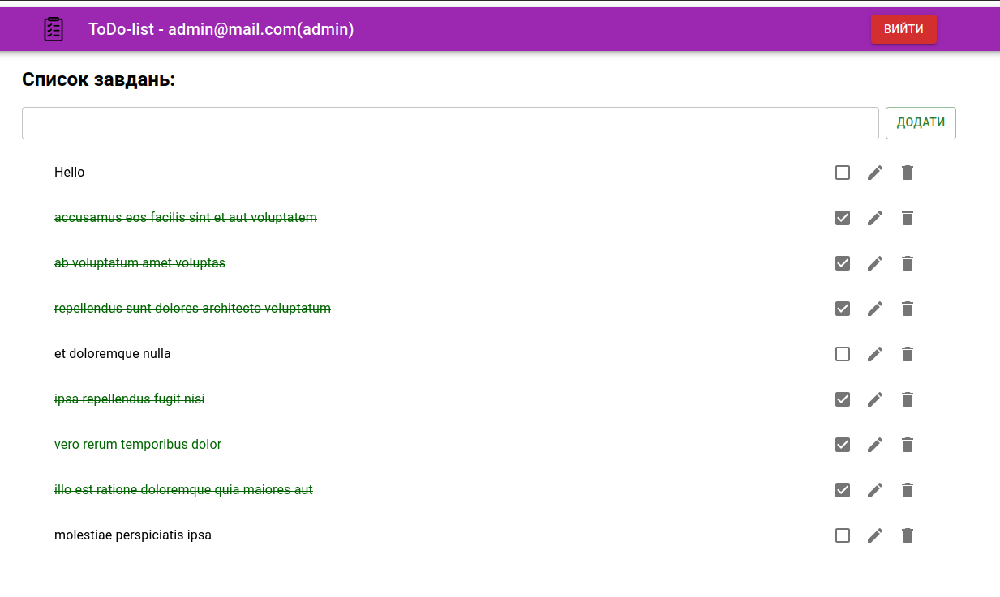

# react-ts-mdb-auth-rest-api
Шаблон для React на [Material UI Kit (MUI)](https://mui.com/material-ui/getting-started/).
Додаток по-замовчуванню має:
* Сторінка атворизації/реєстрації
* Сторінка відображення і керування списком завдань
* Перевірка і оновлення токенів доступу

## Використано:
* 
* 
* 
* 

Для запуску:
* Клонувати репозиторій
* `yarn start` or `npm start`
